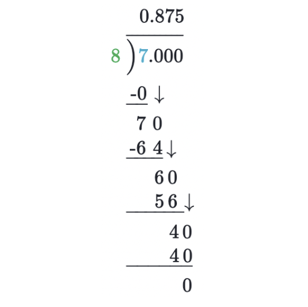

## Intuition
a / b에서 소수점을 수학적으로 구하는 방법은, a를 b로 나눈 나머지에 10을 곱한 값을 b로 나눴을 때의 몫을 순서대로 적는 것을 계속 반복하면 됩니다.

## Algorithm
문제 hint에 나와있듯이, format 함수 만으로는 소수점 20번째까지의 값을 올바르게 구할 수 없습니다.

이 문제는 다음과 같이 접근해봐야 합니다. 예를 들어 1 / 7을 계산하는 과정을 생각해보겠습니다.

> 1 / 7 = 0.142857143...

여기서 소수점을 어떻게 계산할 수 있는지를 생각해보면, 나머지에 10을 곱한 값을 7로 나눴을 때의 몫을 순서대로 적는 것을 계속 반복하면 됩니다.

> 1 * 10을 7로 나눴을 때의 몫은 1입니다. 이때 나머지는 3이 됩니다.  
> 3 * 10을 7로 나눴을 때의 몫은 4입니다. 이때 나머지는 2가 됩니다. 
> 2 * 10을 7로 나눴을 때의 몫은 2입니다. 이때 나머지는 6이 됩니다. 
> 6 * 10을 7로 나눴을 때의 몫은 8입니다. 이때 나머지는 4가 됩니다.  
...
> 
좀 더 간단한 예시로, 7 / 8이 왜 0.875가 나오는지를 그림으로 나타내보면 다음과 같습니다.

